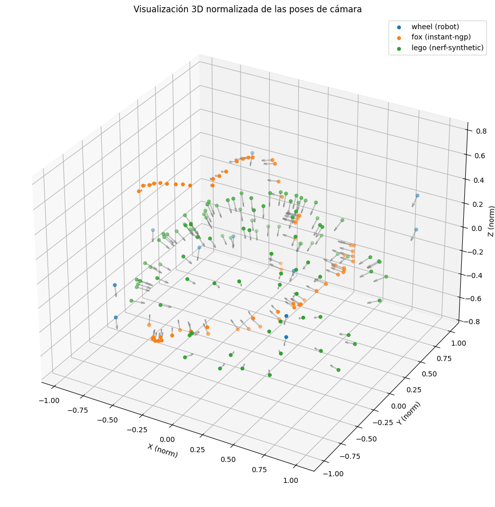

# Generación de Escenas 3D con NeRF utilizando Cinemática Directa



Este repositorio contiene el código, datasets, modelos entrenados y resultados del Trabajo Fin de Máster realizado en el Máster Universitario en Big Data Science (2024–2025). El objetivo es evaluar la viabilidad de reconstrucción 3D mediante NeRF utilizando la **cinemática directa de un sistema robotizado** como fuente de poses, prescindiendo de soluciones tradicionales como COLMAP.

---

## 📌 Objetivo

Desarrollar un pipeline de reconstrucción tridimensional eficiente y automático, entrenando modelos NeRF a partir de imágenes RGB y poses obtenidas directamente del robot. Se compara el rendimiento de:
- **Instant-NGP** (NeRF rápido con codificación hash)
- **NeRF clásico** (implementación en PyTorch)

---

## 🛠 Estructura del proyecto

```
├── datasets/               # Datos originales y preprocesados
│   ├── instant-ngp-preprocessed/
│   └── nerf-raw/
│
├── nerf/                  # NeRF clásico (PyTorch)
│   ├── data/              # Datasets de ejemplo (lego, fern, etc.)
│   ├── run_nerf.py        # Entrenamiento y visualización
│   └── logs/              # Modelos entrenados y resultados
│
├── nerf-pytorch/          # NeRF optimizado con configuraciones
│
├── instant_ngp/           # Instant-NGP original (CUDA)
│   └── scripts/           # Scripts de preparación (COLMAP, etc.)
│
├── trained_models/        # Modelos .ingp y checkpoints
│
├── results/               # Reconstrucciones, visualizaciones, métricas
│
├── parser_instant_ngp.py # Conversor de poses.txt a transforms.json
└── paralaje.ipynb         # Notebook de análisis de paralaje
```

---

## 📷 Datos y Hardware

- Imágenes capturadas por un **brazo robótico de 6 DOF**.
- Cámara: **Intel RealSense D405**
- Formato de poses: matrices homogéneas 4×4 (`poses.txt`)
- Resoluciones típicas: 1280×720 (HD)
- Formato final para Instant-NGP: `transforms.json`

---

## 🧪 Modelos entrenados

Se entrenaron y evaluaron los siguientes modelos:
- `NeRF clásico` (PyTorch): requiere tensores y generación de rayos
- `Instant-NGP` (NVIDIA): usa `transforms.json` y entrena en segundos

⚠️ Los resultados con el dataset del robot fueron **subóptimos** debido a escaso paralaje. Se documenta cómo este factor afecta a la reconstrucción.

---

## 📈 Resultados

Se compararon reconstrucciones en datasets `fox`, `lego` y `wheel`:

| Dataset  | Paralaje | PSNR aprox. | Observaciones |
|----------|----------|-------------|----------------|
| fox      | Alto     | >20 dB      | Reconstrucción buena |
| lego     | Medio    | >25 dB      | Dataset de referencia |
| wheel    | Bajo     | <10 dB      | Poses similares, mala geometría |


---

## 🚀 Uso rápido

### 🔧 1. Preprocesamiento

```bash
python parser_instant_ngp.py --input poses.txt --images_dir images_robot/ --output transforms.json --recenter --scale_trans
```

### 🟢 2. Instant-NGP (ver carpeta `instant_ngp/`)

Se llama al script desde el notebook `instant_ngp_collab_cloud.ipynb`

### 🔵 3. NeRF clásico (ver carpeta `nerf/`)
```bash
python run_nerf.py --config configs/lego.yml
```

## 👤 Autor

**Bartomeu Payeras Martorell**  
Trabajo Fin de Máster – Universidad de Navarra  
Tutor académico: Pablo Argüelles Lebrón  
Tutores de empresa: Diego Borro Yágüez, Olatz Iparraguirre Gil

---

## 📄 Licencia

Este repositorio incluye software de terceros bajo sus propias licencias (ver carpetas `instant_ngp/`, `nerf/`, etc.). El código propio se distribuye bajo licencia MIT.
